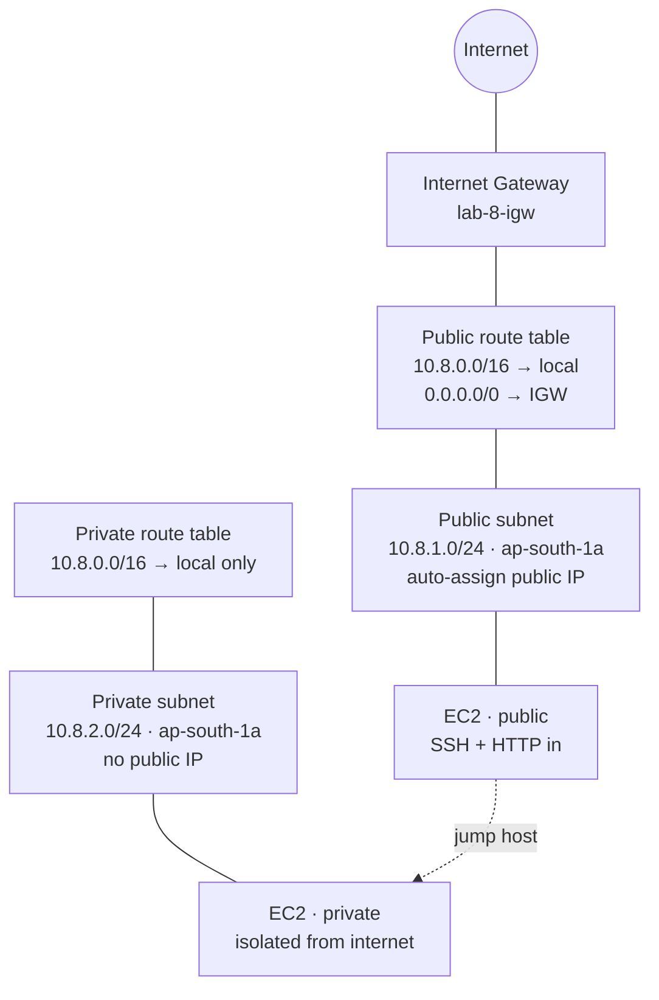

# Lab 8: AWS VPC Networking

Your résumé says EC2, VPC, IAM. This lab makes that **defensible**: one VPC,
two subnets, real routing and firewall behavior — built with the AWS CLI,
broken on purpose, then troubleshot like a NOC engineer would.

> **Résumé line:** *Built and troubleshot an AWS VPC (public/private subnets,
> route tables, IGW, security groups vs NACLs) using the AWS CLI — including
> 4 deliberate misconfiguration drills with root-cause write-ups.*
>
> **Don't claim:** *"I run production AWS infrastructure."* This is a
> lab in your own AWS account, built to prove you understand cloud networking
> instead of just listing "AWS" as a keyword.

**Lab series:** [Lab 1](https://github.com/kn2702-sys/enterprise-vlan-lab) · [Lab 2](https://github.com/kn2702-sys/dhcp-dns-failure-lab) · [Lab 3](https://github.com/kn2702-sys/LAB-3-Multi-Router-OSPF-Network) · [Lab 4](https://github.com/kn2702-sys/LAB-4-ACL-NAT-Internet-Edge) · [Lab 5](https://github.com/kn2702-sys/LAB-5-Site-to-Site-VPN-Firewall) · [Lab 6](https://github.com/kn2702-sys/LAB-6-Wireshark-NOC-Troubleshooting) · [Lab 7](https://github.com/kn2702-sys/LAB-7-NOC-Incident-Simulation) · **Lab 8**

---

## Architecture



```text
Region: ap-south-1 (Mumbai)

VPC 10.8.0.0/16 (lab-8-vpc)
|
+-- Public subnet  10.8.1.0/24 -- route table: 0.0.0.0/0 -> IGW -- EC2 (public IP)
|
+-- Private subnet 10.8.2.0/24 -- route table: local only      -- EC2 (no public IP)
```

## What you build

| Component | Name | Purpose |
|---|---|---|
| VPC | `lab-8-vpc` · `10.8.0.0/16` | Isolated network boundary |
| Public subnet | `lab-8-public` · `10.8.1.0/24` | Internet-reachable tier |
| Private subnet | `lab-8-private` · `10.8.2.0/24` | Isolated tier (DB/app pattern) |
| Internet Gateway | `lab-8-igw` | VPC ↔ internet |
| Public route table | `lab-8-public-rt` | `0.0.0.0/0 → IGW` |
| Private route table | `lab-8-private-rt` | local only (the whole point) |
| Security groups | `lab-8-public-sg`, `lab-8-private-sg` | Stateful instance firewalls |
| EC2 × 2 | Amazon Linux 2023, t2/t3.micro | One per subnet |

## Repository map

| Path | What it is |
|---|---|
| [`docs/ARCHITECTURE.md`](docs/ARCHITECTURE.md) | CIDR plan, AZ choice, component decisions |
| [`docs/BUILD-CLI.md`](docs/BUILD-CLI.md) | Full AWS CLI walkthrough (recommended) |
| [`docs/BUILD-CONSOLE.md`](docs/BUILD-CONSOLE.md) | Console click-path alternative |
| [`docs/CONCEPTS.md`](docs/CONCEPTS.md) | Why public works, why private doesn't, SG vs NACL, packet flows, NAT Gateway, SSM/IAM |
| [`docs/TROUBLESHOOTING.md`](docs/TROUBLESHOOTING.md) | 4 misconfiguration drills (route table, SG, subnet, NACL/inbound) |
| [`docs/VERIFICATION.md`](docs/VERIFICATION.md) | Prove-it checklist |
| [`docs/INTERVIEW.md`](docs/INTERVIEW.md) | Spoken answers for the 6 core questions |
| [`docs/CLEANUP.md`](docs/CLEANUP.md) | Tear down everything (avoid surprise bills) |
| [`scripts/build.sh`](scripts/build.sh) | Runnable build (wraps the CLI guide) |
| [`scripts/cleanup.sh`](scripts/cleanup.sh) | Runnable teardown |

## Cost & safety

- EC2 **t2.micro / t3.micro** + EBS: free-tier eligible. Everything else here (VPC, subnets, route tables, IGW, SGs, NACLs) is **free**.
- **NAT Gateway is NOT free** (~$0.045/hr + data). It's covered as a *design question* in CONCEPTS, not built — the private subnet stays truly isolated, which is what the drills need.
- **Run [`docs/CLEANUP.md`](docs/CLEANUP.md) when done.** A forgotten running instance is the classic fresher AWS bill.

## Prerequisites

- An AWS account (free tier is fine)
- AWS CLI v2 installed and `aws configure` completed
- ~60–90 minutes

## Skills demonstrated

VPC & subnet design · CIDR planning · route tables & longest-prefix match ·
internet gateways · security groups (stateful) vs NACLs (stateless) ·
public vs private subnet patterns · jump-host SSH · IAM roles for EC2
(SSM Session Manager) · structured cloud troubleshooting
